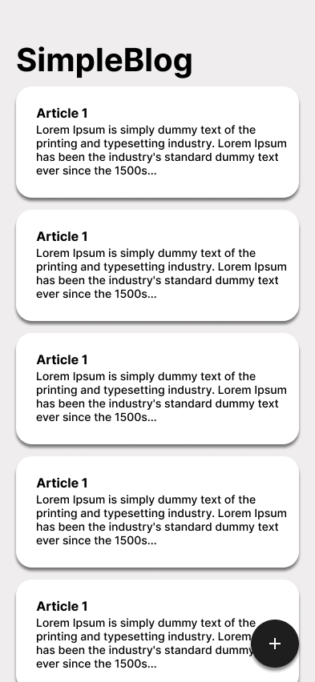
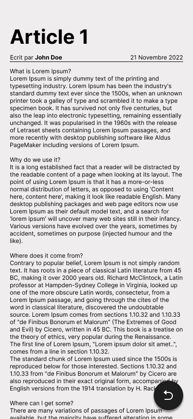
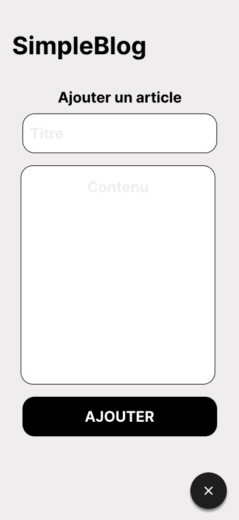

# 🚀 Galsen Dev - WeekEnd Code Demo 🚀

This repo contains the source code of our demo at [GalsenDev](https://github.com/GalsenDev221) "WeekEnd du Code" event.  
The topic of our talk was `Flutter State Management: A Simple Use Case With BLoC & Riverpod`.

## Use Case Description

For the demo implementation, we decide to create a simple blog app with three (3) main features/screens :

- A homepage for displaying the list of articles
- Another page for displaying the details of a specific article
- And a last one that allow us to create a new article

We also add `pull-to-refresh` and `automatic data polling` features.

## Target Design

<table>
    <tr>
        <td></td>
        <td></td>
        <td>/</td>
    </tr>
</table>

## Stack & Repository Architecture

For the implementation of our demo use case, we use [Flutter](https://flutter.dev/) & [NestJS](https://nestjs.com/).  
In this repo, you'll find the following directories :

- [api](https://github.com/PapiHack/galsen-dev-wec-demo/tree/master/api) folder that contains the `REST API` source code built with [NestJS](https://nestjs.com/).
- [simple_blog_app](https://github.com/PapiHack/galsen-dev-wec-demo/tree/master/simple_blog_app) folder that contains the flutter use case implementation with [Riverpod](https://riverpod.dev/).
- [simple_blog_app_using_bloc_pattern](https://github.com/PapiHack/galsen-dev-wec-demo/tree/master/simple_blog_app_using_bloc_pattern) folder that contains the flutter use case implementation with [BLoC](https://bloclibrary.dev/).

## Contributing

Feel free to make a PR or report an issue 😃

Oh, one more thing, please do not forget to put a description when you make your PR 🙂

## Authors

- [M.B.C.M](https://itdev.sn)
  

- [DEVAL](http://www.deval.website)
  
