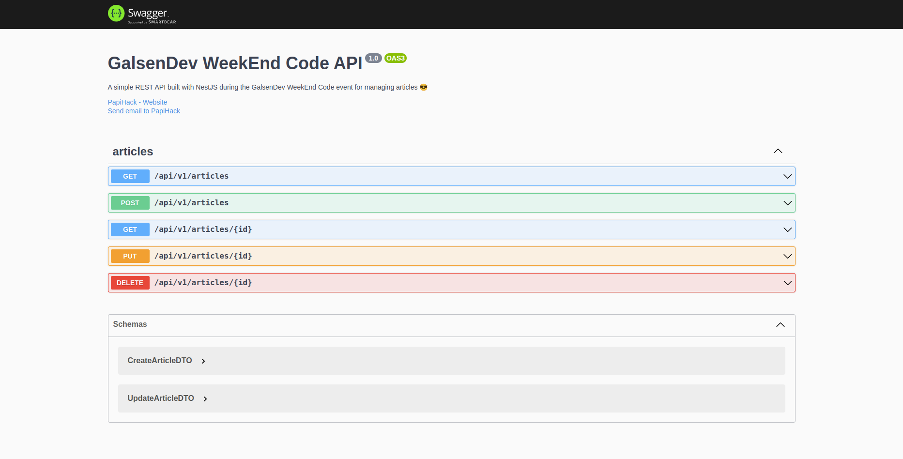

# GalsenDev WeekEnd Code Demo - NestJS Articles REST API

  

This is a simple REST API built with `NestJS` during `GalsenDev WeekEnd Code event` for managing articles.
I also use `Docker` & `Docker Compose` in order to containerize the stack.

## Usage

### Local Installation

- After cloning or pulling the project, edit the .env file, fill in the parameters located at the level of the .env.example file and rename it to `.env`.

- Run `npm install` in order to install all necessary dependecies

- Edit `config/typeorm.config.ts` file by updating `type` property of `TypeOrmConfiguration` variable depending on your database type (`mysql`, `postgres`, etc).

- Run `npm run start` in order to start the nest server

- Then go to <http://localhost:3000/docs> in order to visualize the `Swagger Documentation` of the API

### Docker Installation

If you already have `Docker` and `Docker Compose` installed in your system, you have just to :

- Rename the `.env.example` file to `.env`

- Run the following command: `docker-compose up -d`

After that, you can visit <http://localhost:8080/docs>

Run `docker-compose down` to stop and remove all the services or `docker-compose stop` to only stop services.

### Screenshots

## Contributing

Feel free to make a PR or report an issue 😃

Oh, one more thing, please do not forget to put a description when you make your PR 🙂

## Contributors

- [M.B.C.M](https://itdev.sn)

- [DEVAL](http://www.deval.website)
  
